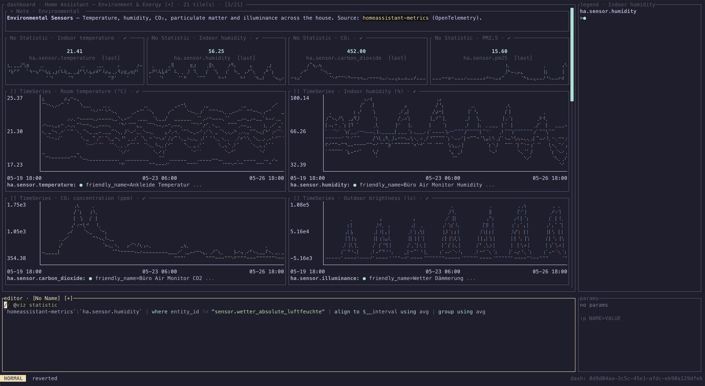

# ax

A terminal interface for querying [Axiom](https://axiom.co). You write
MPL in a vim-style editor, charts render alongside, and you can browse
or edit Axiom dashboards inline.



It uses the same `~/.axiom.toml` config file as the official Axiom
CLI, so if you've already authenticated there, you're done.

## Installing

There's no published binary yet. Build from source:

```sh
git clone <this-repo>
cd ax
cargo install --path .
```

Rust 1.85 or newer.

## Configuration

If you don't already have an `~/.axiom.toml`:

```toml
active_deployments = "prod"

[deployments.prod]
url    = "https://api.axiom.co"
token  = "xaat-..."
org_id = "..."
```

`active_deployments` is optional when you only have one entry. To pick
a different deployment for a single launch without editing the file,
pass `--deployment NAME` (or `-D NAME`); the flag overrides
`active_deployments` for that session only.

## Running

`ax` opens an empty editor; your last query comes back from
the cache. To open a file:

```sh
ax my-query.mpl
```

To jump straight into a resource, use a subcommand (names may be
abbreviated to any unambiguous prefix, e.g. `ax tr` / `ax da`):

```sh
ax dashboard <dashboard-uid>
ax trace <trace-id> [--dataset <name>]
```

The trace dataset defaults to your saved `:trace set dataset=…`; the
global `-D/--deployment` flag selects the deployment for either
subcommand.

If your MPL declares parameters (`param $host: string;`) you can
supply values from the command line:

```sh
ax -p host=db-01 -p region=us-east
```

`--help` prints the full list; `--version` prints the build version.

## Using it

Type MPL, hit Enter, see the chart. Use `:` for commands (`:w` to save
the file, `:q` to quit, `:open <uid>` to load a dashboard). Use `?`
for the full key reference at any time.

The chart kind is picked by a comment at the top of the buffer:

```
// @viz line
```

Change `line` to `bar`, `area`, `scatter`, `pie`, `heatmap`, `table`,
`top_list`, `statistic`, `log_stream`, `monitor_list`, `note`, or
`spacer` to switch chart kinds without touching the query.

A second pragma sets the display unit:

```
// @viz line
// @unit MiBy/s
```

The unit drives axis labels and statistic readouts. The value is a
[UCUM](https://ucum.org/) expression, with a few quality-of-life
extensions:

- Storage and throughput scale automatically: `By`, `KiBy`, `MiBy`,
  `kBy`, `MBy`, `bit`, `Mibit`, `Mbit`, and the matching rates
  (`By/s`, `MiBy/s`, `bit/s`, `Mbit/s`). `1500000 By/s` becomes
  `1.43 MiB/s`.
- Time and frequency scale by magnitude: `ns`, `us`, `ms`, `s`,
  `min`, `h`, `d`; `Hz`, `kHz`, `MHz`, `GHz`.
- SI engineering units scale with decimal prefixes (`n`, `µ`, `m`,
  base, `k`, `M`, `G`, `T`): `W`, `V`, `A`, `J`, `Pa`, `m`, `g`,
  `L`, `lx`, `lm`, `mol`. `1500 W` becomes `1.50 kW`; `1500 lx`
  becomes `1.50 klx`.
- Mass concentration is supported with friendly typography:
  `ug/m3`, `µg/m3`, `mg/m3`, `g/m3`, `kg/m3`. You can type
  `µg/m³` directly; the superscript and Greek mu are normalised.
- Percent (`%`) and OTEL-style annotations (`{request}`) render
  verbatim with no scaling.
- ISO 4217 currency codes (`EUR`, `USD`, `GBP`, `JPY`, `CHF`, ...)
  render with the currency's symbol: `€1234.50`, `£1234.50`. This
  is a deliberate non-UCUM extension.

Resolution order when several sources supply a unit:

1. `MetricInfo.unit` from the metrics-info endpoint.
2. The `otel.metric.unit` tag on a series.
3. The `// @unit` pragma in the editor buffer.

The pragma updates live while you type — you do not have to rerun
the query to switch the axis from `By` to `MiB` or from `ms` to `s`.

### Dashboards

`:dash ls` opens a searchable picker over every dashboard in your
workspace. Pick one and you land in a grid view; the editor binds
to the focused tile so navigating with `Tab` / `hjkl` swaps which
query you're editing. Press Enter on a tile to zoom into it.

Edits save back to Axiom — change the query, move tiles around with
`m`/`s` (auto-shove cascades neighbours; shrinking pulls lower tiles
up) or `:tile mv!` / `:tile size!`, then `:w` (refuses if someone
else bumped the version) or `:w!` to overwrite. `:wq` waits for the
async save to land before quitting.

The dashboard pane is also vim-flavoured at the tile level: `y` /
`x` / `p` yank, cut, and paste tiles (block-shape preserved); `u`
is a one-level undo; `a` adds a new tile; `d` deletes with confirm.
Counts work (`3y`, `2x`).

### Time range

`:time` opens a preset menu (last 5 minutes, last hour, today,
yesterday, …) or a calendar for custom ranges. The range applies to
whichever query or dashboard is in front of you.

### Parameters

If your query has `param $host: string;` at the top, the param panel
on the right shows it; press `i` in the panel to fill in a value, or
set it from the command line with `:p host=db-01`. The same panel is
how you clear a value (`x`) or wipe everything (`:p!`).

## Keys

Full reference: [`docs/keys.md`](docs/keys.md). Same file the in-app
`?` renders. The keymap is vim-flavoured: `hjkl`, `gg`/`G`,
`dd`/`yy`/`p`, `:` for commands, visual mode, operators on text
objects, the usual.

A few things to know up front:

- `:q` is the only quit. There's no bare `q` shortcut anywhere.
- `Esc` always closes the current thing — an overlay, a picker, a
  zoomed-in chart back to the grid, or a sidebar pane back to the
  editor.
- Ex-command completion is fuzzy: `:dl<Tab>` finds `:dash ls`,
  `:tm<Tab>` finds `:time`. Plain prefix matches still come first.

## Where state lives

Datasets, metric lists, dashboard listings, and the last query you
edited are cached under `$XDG_CACHE_HOME/ax/` (or the
platform equivalent). Deleting the directory resets the app; nothing
on the Axiom server is affected.

## Limitations

APL queries inside dashboards are shown but not executed — only MPL
tiles fetch live data.
